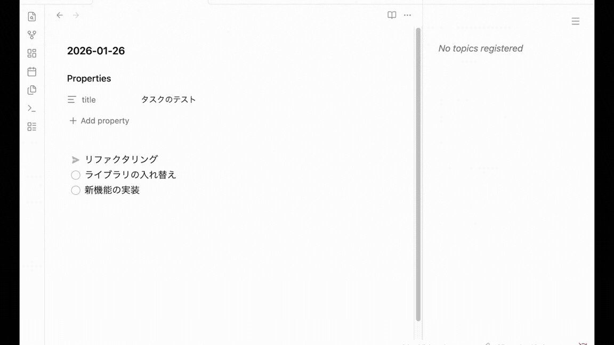

# Topic Lines

ノート内の任意の行をトピックとしてサイドバーにピン留めし、素早くアクセス・ナビゲーションできるObsidianプラグインです。

## 機能

- **トピック登録**: ノート内の任意のテキストを選択してトピックとして登録
- **サイドバー表示**: 登録したトピックを専用のサイドバーパネルで一覧表示
- **クイックナビゲーション**: トピックをクリックしてソースファイルの該当行に直接ジャンプ
- **キーボードショートカット**: カスタマイズ可能なホットキーでトピック1〜9にジャンプ
- **ドラッグ＆ドロップで並び替え**: サイドバー内でトピックをドラッグして順序を変更
- **Markdownレンダリング**: トピックをMarkdown形式で表示
- **Frontmatter表示**: トピックと一緒にfrontmatterの値を表示可能
- **ファイル追跡**: ソースファイルがリネームされると自動的に更新
- **モバイル対応**: デスクトップとモバイルの両方で動作

## 使い方

### トピックの登録

1. ノートを開き、トピックとして登録したいテキストを選択（または行にカーソルを置く）
2. コマンドパレットを開く（Cmd/Ctrl + P）
3. **Topic Lines: Register selected lines** コマンドを実行

選択したテキスト（またはカーソル行）が保存され、サイドバーに表示されます。

### トピックの登録/解除の切り替え

1. トピックとして登録または解除したい行にカーソルを置く
2. コマンドパレットを開く（Cmd/Ctrl + P）
3. **Topic Lines: Toggle current line** コマンドを実行

行が既にトピックとして登録されている場合は解除され、そうでなければ新しいトピックとして登録されます。

### トピックの表示

**Topic Lines: Show sidebar** コマンドを実行するか、サイドバーアイコンをクリックしてトピック一覧を開きます。

### トピックへのナビゲーション

- サイドバー内のトピックをクリックして、ソースファイルの該当位置にジャンプ
- **Topic Lines: Jump to topic 1-9** コマンドでキーボードから素早くナビゲーション

### トピックの削除

サイドバー内のトピックにカーソルを合わせ、×ボタンをクリックして削除します。

### トピックの並び替え

サイドバー内でトピックをドラッグ＆ドロップして順序を変更できます。

## 設定

**設定 → コミュニティプラグイン → Topic Lines** から設定にアクセスできます。

- **Frontmatter keys**: トピックと一緒に表示するfrontmatterキーを指定（カンマ区切り）
- **Show file name**: 各トピックの下にソースファイル名を表示するかどうかを切り替え

## インストール

### BRATを使用

1. [BRAT](https://github.com/TfTHacker/obsidian42-brat) プラグインをインストール
2. **設定 → BRAT → Add Beta plugin** を開く
3. `handlename/obsidian-plugin-topic-lines` を入力
4. **Add Plugin** を選択
5. **設定 → コミュニティプラグイン** でプラグインを有効化

## コマンド

| コマンド | 説明 |
|---------|------|
| Register selected lines | 選択したテキスト（またはカーソル行）をトピックとして登録 |
| Unregister selected lines | 選択した行（またはカーソル行）のトピック登録を解除 |
| Toggle current line | カーソル行のトピック登録/解除を切り替え |
| Show sidebar | トピック一覧のサイドバーを開く |
| Jump to topic 1 | 1番目のトピックにナビゲート |
| Jump to topic 2 | 2番目のトピックにナビゲート |
| Jump to topic 3 | 3番目のトピックにナビゲート |
| Jump to topic 4 | 4番目のトピックにナビゲート |
| Jump to topic 5 | 5番目のトピックにナビゲート |
| Jump to topic 6 | 6番目のトピックにナビゲート |
| Jump to topic 7 | 7番目のトピックにナビゲート |
| Jump to topic 8 | 8番目のトピックにナビゲート |
| Jump to topic 9 | 9番目のトピックにナビゲート |
| Clear all topics | 登録されているすべてのトピックを削除 |

## ライセンス

0-BSD
