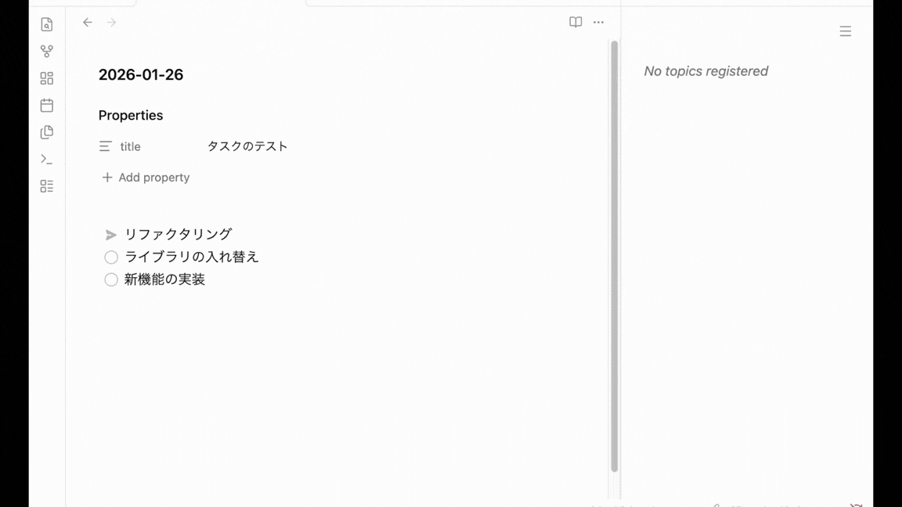

# Topic Lines

ノート内の任意の行を「名前付きスロット」にトピックとして配置し、サイドバーから素早くアクセス・ナビゲーションできるObsidianプラグインです。

> **注意**: スクリーンキャストはv1のUIです。v2はslotベースのインターフェースに刷新されています。詳しくは下記の「使い方」を参照してください。

## 機能

- **スロットベースのトピック整理**: 名前付きスロット（1〜20個、デフォルト3個）にトピックを配置
- **サイドバー表示**: 設定した順序ですべてのスロットを常に表示。空のスロットはプレースホルダとして表示
- **スロットごとのコマンド**: 各スロットに対して直接「トピックを設定」「ジャンプ」コマンドを利用可能
- **スロットのカスタマイズ**: 設定画面でスロットの追加・削除・名前変更・並び替えが可能
- **クイックナビゲーション**: トピックをクリックしてソースファイルの該当行に直接ジャンプ
- **Markdownレンダリング**: トピックをMarkdown形式で表示
- **Frontmatter表示**: トピックと一緒にfrontmatterの値を表示可能
- **ファイル追跡**: ソースファイルのリネームや内容変更に自動的に追従
- **モバイル対応**: デスクトップとモバイルの両方で動作

## v1からのアップグレード

> アップグレード前にvaultをバックアップしてください。v1 → v2のマイグレーションは元に戻せません。

v2を初めて起動すると、既存のv1トピックは自動的にスロットへ移行されます。

- 各トピックは自動生成されたスロット（`slot1`、`slot2`、…）に配置されます
- トピックが20個を超える場合、先頭から20個のみ移行され、超過分はNoticeで通知されます
- 既存設定（`Frontmatter keys`、`Show file name`）は保持されます
- 新しい`Collision mode`設定は`Confirm before overwrite`がデフォルトです

## 使い方

### 最初の空きスロットにトピックを登録する

1. ノートを開き、トピックとして登録したいテキストを選択（または行にカーソルを置く）
2. コマンドパレットを開く（Cmd/Ctrl + P）
3. **Topic Lines: Register selected lines** コマンドを実行

並び順で最初の空きスロットにトピックがセットされます。すべてのスロットが埋まっている場合は「No empty slot available.」と通知されます。

### 特定のスロットにトピックを設定する

1. テキストを選択（または行にカーソルを置く）
2. **Topic Lines: Set topic to {slotName}** コマンドを実行（対象スロット名のもの）
3. スロットが既に占有されている場合:
   - `Confirm before overwrite` モード（デフォルト）: 確認ダイアログが表示される
   - `Overwrite without confirmation` モード: 確認なしで上書きされる

### トピックの登録/解除を切り替える

**Topic Lines: Toggle current line** コマンドを実行します。該当行が既に登録済みなら解除、未登録なら最初の空きスロットに登録されます。

### スロット一覧の表示

**Topic Lines: Show sidebar** コマンドを実行するか、サイドバーアイコンをクリックします。すべてのスロットが順序通り表示され、占有スロットはトピック内容、空スロットは `(empty)` と表示されます。

### トピックへのナビゲーション

- サイドバー内のトピックをクリックして該当箇所にジャンプ
- **Topic Lines: Jump to {slotName}** コマンドでキーボードからナビゲーション（スロットごとに動的登録）

### スロットからトピックを削除する

サイドバー内のトピックにカーソルを合わせ、×ボタンをクリックします。スロットは空になりますが、スロット自体は残ります。

### スロットの管理

**設定 → コミュニティプラグイン → Topic Lines → Slots** で以下を操作できます:

- スロットの**追加**（最大20個まで）
- スロットの**削除**（最小1個まで）
- スロット名の**変更**（最大50文字、空文字不可）
- 上下ボタンによる**並び替え**

スロット並び順・名前・追加・削除の変更は即座にサイドバーとコマンドパレットの両方に反映されます。プラグインの再起動は不要です。

### すべてのトピックを削除する

**Topic Lines: Clear all topics** コマンド、またはサイドバーのメニューから実行します。確認ダイアログで承認後、占有されているすべてのスロットが空になります。スロット自体は削除されません。

## 設定

**設定 → コミュニティプラグイン → Topic Lines** から設定にアクセスできます。

- **Frontmatter keys**: トピックと一緒に表示するfrontmatterキーを指定（カンマ区切り）
- **Show file name**: 各トピックの下にソースファイル名を表示するかどうか
- **Collision mode**: per-slot コマンドで占有スロットにトピックを設定する際の挙動（`Confirm before overwrite` / `Overwrite without confirmation`）
- **Slots**: スロットの追加・削除・名前変更・並び替え

## インストール

### BRATを使用

1. [BRAT](https://github.com/TfTHacker/obsidian42-brat) プラグインをインストール
2. **設定 → BRAT → Add Beta plugin** を開く
3. `handlename/obsidian-plugin-topic-lines` を入力
4. **Add Plugin** を選択
5. **設定 → コミュニティプラグイン** でプラグインを有効化

## コマンド

| コマンド | 説明 |
|---------|------|
| Register selected lines | 選択テキスト（またはカーソル行）を最初の空きスロットにトピックとして登録 |
| Unregister selected lines | 選択行（またはカーソル行）にあるトピックをスロットから外す |
| Toggle current line | カーソル行のトピック登録/解除を切り替え |
| Show sidebar | トピック一覧のサイドバーを開く |
| Set topic to {slotName} | 選択テキスト（またはカーソル行）を指定スロットにトピックとして設定（スロットごとに動的登録） |
| Jump to {slotName} | 指定スロットのトピックへナビゲート（スロットごとに動的登録） |
| Jump to topic 1〜9 | 並び順で N 番目のスロットにあるトピックへナビゲート（位置ベース固定、`Jump to {slotName}` と並存。v1 のホットキー割り当てを保持） |
| Clear all topics | すべてのスロットからトピックを削除（スロット自体は残る） |

## 既知の制限

- **per-slot コマンドの ID は位置ベース**: `Set topic to slot1` に割り当てたホットキーは「並び順で最初のスロット」を指します。並び替えるとホットキーは新しい先頭スロットを指すようになります。

## ライセンス

0-BSD
