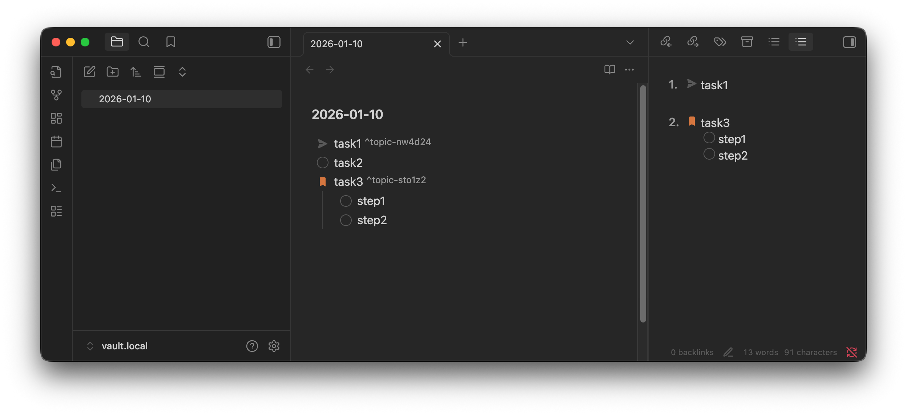

# Topic Lines

[日本語](README.ja.md)

An Obsidian plugin that lets you pin specific lines from your notes as topics in a sidebar for quick access and navigation.

## Features

- **Register topics**: Select any text in your notes and register it as a topic
- **Sidebar view**: Access all your registered topics from a dedicated sidebar panel
- **Quick navigation**: Click a topic to jump directly to that line in the source file
- **Keyboard shortcuts**: Jump to topics 1-3 using customizable hotkeys
- **Drag and drop reordering**: Reorganize your topics by dragging them in the sidebar
- **Markdown rendering**: Topics display with full Markdown formatting
- **Frontmatter display**: Optionally show frontmatter values alongside topics
- **File tracking**: Topics automatically update when their source file is renamed
- **Mobile support**: Works on both desktop and mobile devices

## Usage

### Registering a topic

1. Open a note and select the text you want to register as a topic
2. Open the command palette (Cmd/Ctrl + P)
3. Run the command **Topic Lines: Register topic**

The selected text will be saved and appear in the sidebar.

### Viewing topics

Run the command **Topic Lines: Show sidebar** or click the sidebar icon to open the topic list.

### Navigating to a topic

- Click any topic in the sidebar to jump to its location in the source file
- Use the commands **Topic Lines: Jump to topic 1/2/3** for quick keyboard navigation

### Deleting a topic

Hover over a topic in the sidebar and click the × button to remove it.

### Reordering topics

Drag and drop topics in the sidebar to change their order.

## Settings

Access settings via **Settings → Community plugins → Topic Lines**.

- **Frontmatter keys**: Specify frontmatter keys to display alongside topics (comma-separated)
- **Show file name**: Toggle displaying the source file name under each topic

## Installation

### Using BRAT

1. Install [BRAT](https://github.com/TfTHacker/obsidian42-brat) plugin
2. Open **Settings → BRAT → Add Beta plugin**
3. Enter `handlename/obsidian-plugin-topic-lines`
4. Select **Add Plugin**
5. Enable the plugin in **Settings → Community plugins**

## Commands

| Command | Description |
|---------|-------------|
| Register topic | Register selected text as a topic |
| Show sidebar | Open the topic list sidebar |
| Jump to topic 1 | Navigate to the first topic |
| Jump to topic 2 | Navigate to the second topic |
| Jump to topic 3 | Navigate to the third topic |

## License

0-BSD
